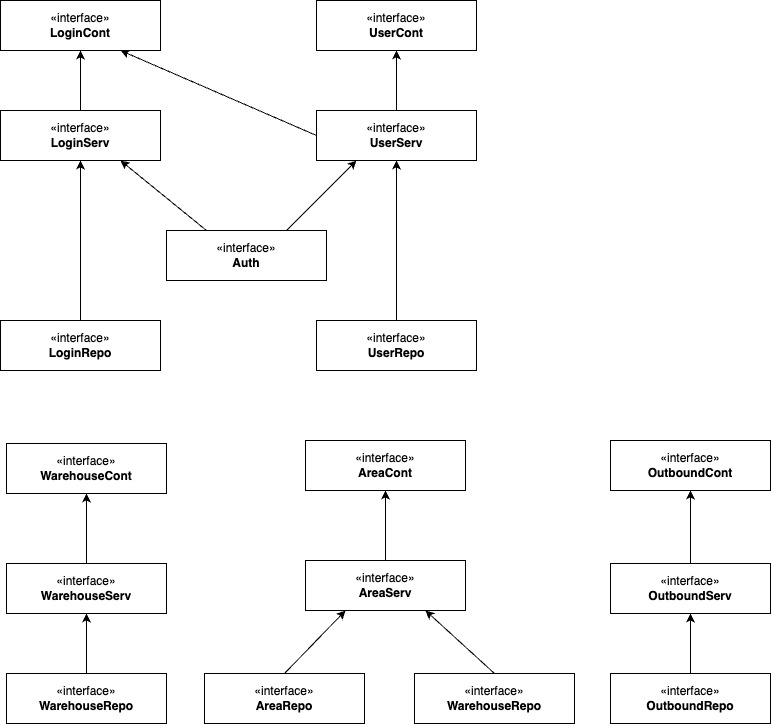

#  🍅 🥬 🍋 Chill Stock 🍓 🧊 🥦
### Chill Out, We’ll Keep It Fresh ❄️🥬

At Chill Stock, we let the customers chill while we handle the chill.
Built for managing perishable goods in warehouse environments, this system automatically takes care of temperature, storage conditions, and space optimization—so your fresh goods stay fresh, and your operations stay cool.

Because fresh goods deserve fresh handling. 

[🇰🇷 한국어 버전으로가기](#-한국어-버전) | [Go to English Version](##-Description) 

## 🧾 Description
**Chill Stock** is a Java-based warehouse management system built to handle fresh goods efficiently.
The system allows users to simply input what items they want to store and in what quantity—**temperature, space, and storage conditions are automatically managed** by the system's algorithm to ensure the goods' best state. 

## 🔑 Key Focus Areas
- Applying **MVC (Model-View-Controller)** architecture with separate layers - controller, service, repository, and model(dto,vo).
- Implementing **manual Dependency Injection (DI)** in Java.
- Designing and integrating a MySQL relational database.
- Using stored procedures, triggers, and constraints for data integrity and automation.
- Emphasizing [**team collaboration**](https://www.notion.so/1bd501101bba80578e4ee8296e04559a?v=1bd501101bba802f92d2000c7960b5ac) and communication.

## 👩‍💻 My Contribution
- Implemented the **Login** and **User Management** features.
- Implemented user authentication and authorization to control access to different system features based on user roles.
- Communicated closely with teammates to ensure seamless integration across modules.
- Focused on writing clean and modular code.
- Maintained team documentation by writing meeting logs and organizing the project Notion page for clear communication and progress tracking.

## 🛠 Tech Stack
- Java
- MySQL
- JDBC (for database connectivity)
- Console-based UI
- Manual DI (no frameworks)

## 🗂️ ERD Diagram 


## 🧱 Class Diagram 
[chill-stock.drawio](../../../Downloads/Smart-fresh.drawio)


## 🏗 Project Structure
```
├── chill-stock/
│   ├── chill-stock/
│   │   ├── doc/
│   │   ├── sql/
│   │   ├── src/
│   │   │   Main.java
│   │   │   ├── area/
│   │   │   │   ├── common/
│   │   │   │   ├── controller/
│   │   │   │   ├── dto/
│   │   │   │   ├── repository/
│   │   │   │   ├── service/
│   │   │   │   ├── vo/
│   │   │   ├── auth/
│   │   │   ├── diconfig/
│   │   │   ├── inbound/
│   │   │   │   ├── controller/
│   │   │   │   ├── dto/
│   │   │   │   ├── exception/
│   │   │   │   ├── repository/
│   │   │   │   ├── service/
│   │   │   │   ├── vo/
│   │   │   ├── login/
│   │   │   │   ├── controller/
│   │   │   │   ├── dto/
│   │   │   │   ├── repository/
│   │   │   │   ├── service/
│   │   │   ├── object/
│   │   │   ├── outbound/
│   │   │   │   ├── common/
│   │   │   │   ├── controller/
│   │   │   │   ├── database/
│   │   │   │   ├── dto/
│   │   │   │   ├── repository/
│   │   │   │   ├── service/
│   │   │   │   ├── vo/
│   │   │   ├── user/
│   │   │   │   ├── controller/
│   │   │   │   ├── dto/
│   │   │   │   ├── repository/
│   │   │   │   ├── service/
│   │   │   │   ├── vo/
│   │   │   ├── view/
│   │   │   ├── warehouse/
│   │   │   │   ├── common/
│   │   │   │   ├── controller/
│   │   │   │   ├── dto/
│   │   │   │   ├── repository/
│   │   │   │   ├── service/
│   │   │   │   ├── vo/
```
## ▶️ How to Run
1. Clone this repository.
2. Set up the database:
   ```bash
   mysql -u [username] -p wms-db < sql/SchemaUser.sql
   mysql -u [username] -p wms-db < sql/Table.sql
   mysql -u [username] -p wms-db < sql/Constraint.sql
   mysql -u [username] -p wms-db < sql/data.sql
   
### ⚙️ Prerequisites
- Java 17+
- MySQL running locally
- A database named `wms-db`

## 📦 Directory Structure Design Principles
- Adopted a Domain-Oriented Structure
- Each layer is clearly separated by functionality, allowing domain-specific logic (e.g., controller, service, DTO) to be grouped and managed in one place, improving maintainability
- As the project scales, this structure helps minimize the impact of adding or modifying features, enhancing scalability and flexibility
- Team members can efficiently divide work by domain

## 🧬 Database Design
- We designed the database schema and ERD diagram from scratch.
- Time was spent discussing the most effective way to model entities like users, goods, and warehouse storage units.
- Relationships were carefully mapped to reflect real-world warehouse logic, such as item quantities, storage zones, and temperature tracking.

## 🤝 Team Collaboration & Practices
- We followed a commit message convention to ensure consistency and clarity (documented in doc/commit-convention.md).
- All code was merged through Pull Requests using a custom pull request template (pull_request_template.md) to ensure code review and communication.
- We had regular meetings to sync progress and discuss architectural decisions.

## 🌱 Future Improvements
- Apply Spring Framework for automated DI and REST API support.
- Add unit tests and integration tests.
- Implement error logging and validation layers.
- Create a simple web UI or REST client.

# 🇰🇷 한국어 버전

#  🍅 🥬 🍋 Chill Stock 🍓 🧊 🥦
### Chill Out, We’ll Keep It Fresh ❄️🥬

Chill Stock은 고객이 편히 쉴 수 있도록, 우리는 신선함을 책임지는 창고 관리 시스템입니다.
온도, 보관 조건, 공간 최적화를 자동으로 처리하여 신선식품이 최상의 상태로 보관될 수 있도록 설계되었습니다.

신선한 식재료엔, 신선한 관리가 필요하니까요.
## 🧾 프로젝트 설명
**Chill Stock**은 신선 식품을 효율적으로 저장하기 위한 Java 기반 창고 관리 시스템입니다.  
사용자는 저장하고 싶은 품목과 수량만 입력하면 되고, 시스템이 **적절한 온도, 공간, 보관 조건을 자동으로 계산 및 관리**해 최적의 상태로 유지해줍니다.  
이 프로젝트는 MVC 아키텍처와 수동 의존성 주입(DI)을 적용한 깔끔한 백엔드 구조를 중심으로 개발되었습니다.

## 🔑 Key Focus Areas
- **MVC(Model-View-Controller)** 아키텍처를 컨트롤러, 서비스, 레포지토리, 모델(dto, vo) 계층으로 분리하여 적용
- Java 기반의 **수동 의존성 주입(DI)** 구현
- MySQL 관계형 데이터베이스 설계 및 연동
- **프로시저**, **트리거**, **제약조건**을 활용하여 데이터 무결성과 자동화 처리
- [**팀 협업**](https://www.notion.so/1bd501101bba80578e4ee8296e04559a?v=1bd501101bba802f92d2000c7960b5ac)과 명확한 커뮤니케이션 중심의 개발

## 👩‍💻 내 역할
- **로그인 및 사용자 관리 기능** 구현
- **사용자 인증 및 권한 분리**를 통해 사용자 역할에 따라 기능 접근 제어
- 팀원들과의 긴밀한 협업을 통해 각 모듈이 원활하게 통합되도록 기여
- **깔끔하고 모듈화된 코드 작성**에 집중
- 팀 회의록을 정리하고 Notion 페이지를 구조화하여 명확한 커뮤니케이션과 팀 내 진척 상황 공유를 담당

## 🛠 기술 스택
- Java
- MySQL
- JDBC (데이터베이스 연결용)
- 콘솔 기반 사용자 인터페이스
- 수동 의존성 주입 (프레임워크 없이 직접 구성)

## 🗂️ ERD 다이어그램


## 🧱 Class 다이어그램
[chill-stock.drawio](../../../Downloads/Smart-fresh.drawio)  


## 🏗 프로젝트 구조
```
├── chill-stock/
│   ├── chill-stock/
│   │   ├── doc/
│   │   ├── sql/
│   │   ├── src/
│   │   │   Main.java
│   │   │   ├── area/
│   │   │   │   ├── common/
│   │   │   │   ├── controller/
│   │   │   │   ├── dto/
│   │   │   │   ├── repository/
│   │   │   │   ├── service/
│   │   │   │   ├── vo/
│   │   │   ├── auth/
│   │   │   ├── diconfig/
│   │   │   ├── inbound/
│   │   │   │   ├── controller/
│   │   │   │   ├── dto/
│   │   │   │   ├── exception/
│   │   │   │   ├── repository/
│   │   │   │   ├── service/
│   │   │   │   ├── vo/
│   │   │   ├── login/
│   │   │   │   ├── controller/
│   │   │   │   ├── dto/
│   │   │   │   ├── repository/
│   │   │   │   ├── service/
│   │   │   ├── object/
│   │   │   ├── outbound/
│   │   │   │   ├── common/
│   │   │   │   ├── controller/
│   │   │   │   ├── database/
│   │   │   │   ├── dto/
│   │   │   │   ├── repository/
│   │   │   │   ├── service/
│   │   │   │   ├── vo/
│   │   │   ├── user/
│   │   │   │   ├── controller/
│   │   │   │   ├── dto/
│   │   │   │   ├── repository/
│   │   │   │   ├── service/
│   │   │   │   ├── vo/
│   │   │   ├── view/
│   │   │   ├── warehouse/
│   │   │   │   ├── common/
│   │   │   │   ├── controller/
│   │   │   │   ├── dto/
│   │   │   │   ├── repository/
│   │   │   │   ├── service/
│   │   │   │   ├── vo/
```

## ▶️ 실행 방법

1. 레포지토리를 클론합니다.
2. 데이터베이스 설정:
   ```bash
   mysql -u [username] -p wms-db < sql/SchemaUser.sql
   mysql -u [username] -p wms-db < sql/Table.sql
   mysql -u [username] -p wms-db < sql/Constraint.sql
   mysql -u [username] -p wms-db < sql/data.sql
   ```

### ⚙️ 사전 조건
- Java 17 이상
- MySQL 로컬에서 실행
- `wms-db` 데이터베이스 생성 필요

## 🧬 데이터베이스 설계

- 데이터베이스 스키마와 ERD 다이어그램을 **처음부터 직접 설계**
- 사용자, 물품, 창고 저장 공간 등 주요 엔티티를 **어떻게 모델링할지 팀원들과 논의**하며 구조화
- 수량, 온도, 공간 구역 등 실제 창고의 운영 로직을 반영하여 엔티티 간 관계를 설계

## 📦 디렉토리 구조 설계 기준
- **도메인 기반 구조(Domain-Oriented Structure)** 채택 
- 각 계층이 기능별로 명확하게 구분되어 각 도메인이 관련된 로직(controller, service, dto 등)을 한곳에 모아 관리할 수 있어 유지보수 용이 
- 프로젝트 범위가 커질 시, 새로운 기능 추가/수정의 영향 범위를 최소화할 수 있어 확장성과 유연성이 높음
- 팀원이 도메인 단위로 작업을 분담

## 🤝 팀 협업 및 개발 방식
- 팀 내 일관성을 위해 커밋 메시지 규칙을 적용 (`doc/commit-convention.md`)
- 모든 코드 변경은 Pull Request(PR)을 통해 병합되었으며, PR 템플릿(`pull_request_template.md`)을 사용
- 정기 회의를 통해 진행 상황을 공유하고 프로젝트 방향성을 함께 논의함

## 🌱 향후 개선 사항

- Spring 프레임워크를 활용하여 자동 DI와 REST API 구조 도입
- 단위 테스트 및 통합 테스트 추가
- 예외 로깅 및 입력 검증 계층 구현
- 간단한 웹 UI 또는 REST 클라이언트 개발 예정