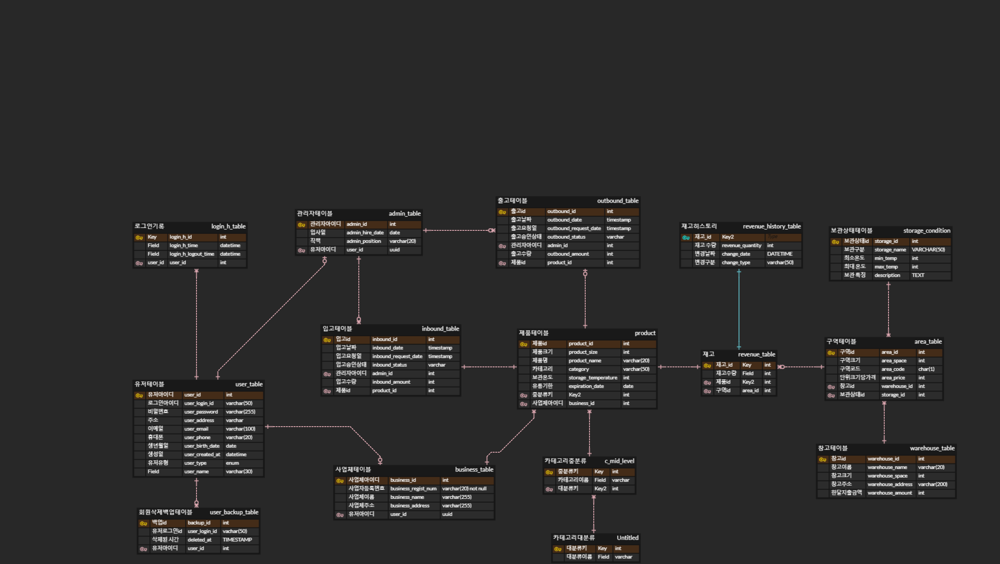
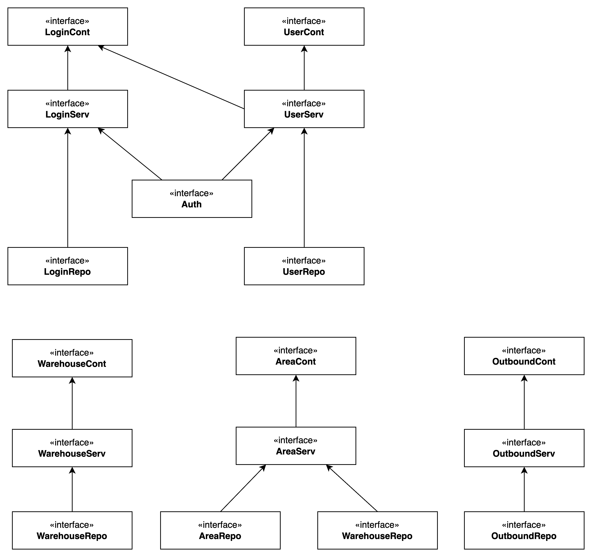

# Chill Stock

## 🇰🇷한국어 버전으로가기

## 🧾 Description
**Chill Stock** is a Java-based warehouse management system built to handle fresh goods efficiently.
The system allows users to simply input what items they want to store and in what quantity—**temperature, space, and storage conditions are automatically managed** by the system to ensure the goods' best state. It was built with a focus on clean backend architecture using the MVC pattern and manual dependency injection.

## 🔑 Key Focus Areas
- Applying **MVC (Model-View-Controller)** architecture with separate layers - controller, service, repository, and model(dto,vo).
- Implementing **manual Dependency Injection (DI)** in Java.
- Designing and integrating a MySQL relational database.
- Using stored procedures, triggers, and constraints for data integrity and automation.
- Emphasizing [**team collaboration**](https://www.notion.so/1bd501101bba80578e4ee8296e04559a?v=1bd501101bba802f92d2000c7960b5ac) and communication.

## 👩‍💻My Contribution
- Implemented the **Login** and **User Management** features.
- Implemented user authentication and authorization to control access to different system features based on user roles.
- Communicated closely with teammates to ensure seamless integration across modules.
- Focused on writing clean and modular code.
- Maintained team documentation by writing meeting logs and organizing the project Notion page for clear communication and progress tracking.

## 🛠Tech Stack
- Java
- MySQL
- JDBC (for database connectivity)
- Console-based UI
- Manual DI (no frameworks)

## 🗂️ ERD Diagram 


## 🧱Class Diagram 
[chill-stock.drawio](../../../Downloads/Smart-fresh.drawio)


## 🏗 Project Structure
```

```
## ▶️ How to Run
1. Clone this repository.
2. Set up the database:
   ```bash
   mysql -u [username] -p wms-db < sql/SchemaUser.sql
   mysql -u [username] -p wms-db < sql/Table.sql
   mysql -u [username] -p wms-db < sql/Constraint.sql
   mysql -u [username] -p wms-db < sql/data.sql
   
### ⚙️ Prerequisites
- Java 17+
- MySQL running locally
- A database named `wms-db`

## 🧬 Database Design
- We designed the database schema and ERD diagram from scratch.
- Time was spent discussing the most effective way to model entities like users, goods, and warehouse storage units.
- Relationships were carefully mapped to reflect real-world warehouse logic, such as item quantities, storage zones, and temperature tracking.

## 🤝Team Collaboration & Practices
- We followed a commit message convention to ensure consistency and clarity (documented in doc/commit-convention.md).
- All code was merged through Pull Requests using a custom pull request template (pull_request_template.md) to ensure code review and communication.
- We had regular meetings to sync progress and discuss architectural decisions.

## 🌱 Future Improvements
- Apply Spring Framework for automated DI and REST API support.
- Add unit tests and integration tests.
- Implement error logging and validation layers.
- Create a simple web UI or REST client.

